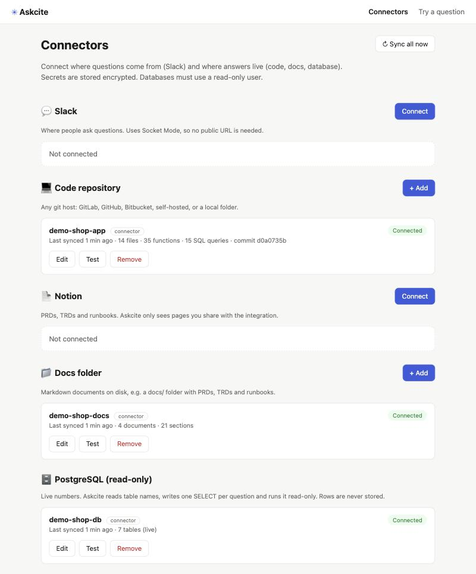
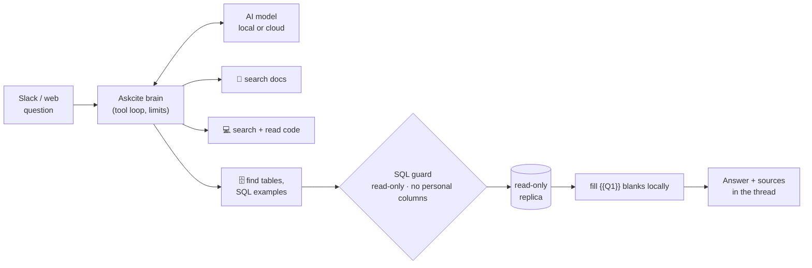

<div align="center">

# ✳ Askcite

**Ask anything about your product, in Slack, and get answers *with citations*: from your code,
your docs and your live database.**

[](https://github.com/shadabshaikh0/askcite/actions/workflows/ci.yml)


</div>

> *"How many orders were settled yesterday?"* · *"What happens when a payment fails?"* ·
> *"What does the settlement TRD say about the cut-off?"*

Non-technical colleagues ask in Slack. Askcite finds the answer in the right place:
- the **code** (any git host);
- the **docs** (Notion or a docs folder);
- the **live database**, read-only. It writes the SQL itself.

It replies in plain English, with **links to the exact lines, document section or query** it used.

<!-- Replace with a real recording: see docs/demo-script.md -->


## Why

The answers to everyday product questions are spread across code, specs and data. Today someone asks in a
channel, and an engineer stops to grep the code or write a query. Askcite answers those questions directly and
shows its sources, so people can trust the answer, or check it.

## Features

- **🔌 Connectors**: connect Slack, Notion, any git repo, PostgreSQL and docs folders from a web page or the
  CLI. *Test* checks the credentials, *Save* stores secrets encrypted, and each card shows its sync status.
- **💻 Understands code**: splits Kotlin and Java into functions with tree-sitter, and **rebuilds the SQL
  written inside your code** (raw strings, `"…" + "…"`, `$variables`). It then uses those queries as examples
  for new ones.
- **🗄️ Answers from live data, safely**: one read-only `SELECT`, checked by a SQL parser. Personal columns
  are blocked, the database user is verified read-only, there are time and row limits, and an audit log keeps no rows.
- **🔒 Data never reaches a cloud AI**: the model writes the answer with blanks (`{{Q1}} orders…`) and Askcite
  fills them in locally.
- **📎 Citations everywhere**: commit-exact code links, document anchors, and a "Show query" button.
- **🧠 Any model**: free local models (Ollama) or Claude, OpenAI or Gemini, via LiteLLM.
- **✅ Measurable**: a test-question runner with 20 demo questions ([benchmarks](docs/benchmarks.md)).

## Try it in 5 minutes (free, with a fake demo shop)

You need **Python 3.11+**, **Docker** and **[Ollama](https://ollama.com/download)**.

```bash
git clone https://github.com/shadabshaikh0/askcite && cd askcite
python3 -m venv .venv && source .venv/bin/activate
pip install -e ".[dev]"
docker compose up -d postgres          # Askcite's own database
ollama pull qwen2.5:7b                 # a free local model (or set a cloud model in sources.yaml)

askcite demo setup                     # fake shop: code repo + docs + database, as connectors
ASKCITE_CONFIG_DIR=examples/demo-shop/config askcite run
```

Open **http://127.0.0.1:8080/connectors**. The user is `admin`, and the password is printed on first start.
Then go to **Try a question**:

- *What happens when a payment fails?* (answered from the code and the runbook)
- *How many orders are in each status right now?* (writes SQL and runs it on the fake database)
- *What is the phone number of the customer who placed order 12?* (refused: personal data)

## How it works



1. The model gets the question and a small set of read-only tools. It's capped at 8 tool calls, 2 queries and
   60 seconds.
2. For data questions it reads the schema and the team's own SQL, then writes **one** query. The guard checks
   it, and it runs on a read-only transaction.
3. It answers with blanks and source ids. Askcite fills in the numbers and posts the answer with links.

More in [docs/architecture.md](docs/architecture.md).

## How your data stays safe

| Layer | What it does |
|---|---|
| Read-only user, verified | The Postgres connector refuses users that can write (superuser, owner, INSERT/UPDATE/DELETE grants) |
| SQL guard | One SELECT, no writes anywhere (CTEs included), no dangerous functions, known tables only |
| Personal columns | Names, phone, email, PAN, bank accounts, passwords… can't be queried, not even in WHERE |
| Execution limits | Read-only transaction, 15 s timeout, 500-row cap |
| No data to cloud models | Answers are written with blanks; values are filled in locally |
| Audit | Every query is logged; rows are never stored |
| Secrets | Encrypted at rest, never shown again, kept out of logs and command lines |
| Admin page | Localhost by default, password, CSRF protection |

Full threat model: [docs/security.md](docs/security.md).

## Connect your own sources

`askcite run`, then open the Connectors page, or use the terminal:

```bash
askcite connect slack      # app + bot tokens (Socket Mode): no public URL needed
askcite connect git        # GitLab / GitHub / Bitbucket / any git: SSH deploy key or read-only token
askcite connect notion     # integration token; share your PRD/TRD pages with it
askcite connect folder     # a folder of Markdown docs
askcite connect postgres   # a READ-ONLY user, ideally on a replica (verified when you connect)
askcite connectors         # status of everything
```

<details>
<summary><b>Setting up each source</b></summary>

- **Slack**: create an app from the manifest in [docs/slack-app.md](docs/slack-app.md) (Socket Mode, bot events
  `app_mention` and `message.im`). Copy the `xapp-…` app-level token and the `xoxb-…` bot token.
- **Notion**: notion.so/my-integrations → *New integration*. On each page: ⋯ → *Connections* → add it.
- **Git**: add a read-only deploy key, or create a token with `read_repository` / `contents:read`.
- **PostgreSQL**: your DBA creates a read-only user on the replica:
  ```sql
  CREATE ROLE askcite_ro LOGIN PASSWORD '…';
  GRANT CONNECT ON DATABASE <db> TO askcite_ro;
  GRANT USAGE ON SCHEMA public TO askcite_ro;
  GRANT SELECT ON ALL TABLES IN SCHEMA public TO askcite_ro;
  ALTER ROLE askcite_ro SET default_transaction_read_only = on;
  ALTER ROLE askcite_ro SET statement_timeout = '15s';
  ```
- **Glossary**: `askcite glossary-draft` lists your most-queried tables. Add a plain-English line for each in
  `glossary.yaml`. This is the biggest win for SQL accuracy.
</details>

You can also define sources in `sources.yaml` (handy for infrastructure-as-code). They appear on the
Connectors page as read-only.

## Configuration

| File | Purpose |
|---|---|
| `sources.yaml` | Timezone, AI model and policy (which model may read what), limits, optional static sources |
| `access.yaml` | Which Slack channels and people may ask; who may ask data questions; approvers |
| `glossary.yaml` | Plain meanings of tables, columns and business words |
| `.env` | Secrets for YAML sources and API keys (connectors keep their own secrets, encrypted) |

Point `ASKCITE_CONFIG_DIR` at the folder holding them. See [config/](config/) for documented examples.

## Commands

| Command | What it does |
|---|---|
| `askcite run` | Web page + Slack bot + background sync |
| `askcite connect <kind>` / `connectors` / `sync` / `disconnect` | Manage connectors from the terminal |
| `askcite ask "<question>" --show-sql` | Ask from the terminal |
| `askcite check-sql "<sql>"` | Would this query pass the safety checks? |
| `askcite index [code\|notion\|docs\|schema]` | Index sources from `sources.yaml` now |
| `askcite eval <questions.yaml> --markdown out.md` | Score a test-question set |
| `askcite demo setup` | The fake demo shop |
| `askcite fake-db` | A fake database (made-up rows) from your schema, for safe testing |
| `askcite glossary-draft` | Glossary skeleton for your most-used tables |
| `askcite admin-password` | Change the web page password |

## Benchmarks

20 questions on the demo shop (code, docs, data and personal-data refusals), scored automatically. See
[docs/benchmarks.md](docs/benchmarks.md), and run `askcite eval` to add your model.

## Project layout

```
askcite/
  connectors/   slack · notion · git · postgres · folder, encrypted store, merge into sources
  web/          Connectors page and "Try a question" (FastAPI + Jinja, no build step)
  brain.py      the tool loop, limits, AI policy, citations
  tools.py      the tools the AI can call
  runtime.py    sources + connectors → workspace, background sync
  sources/      git, tree-sitter code parser, Notion, docs folders, Postgres schema, schema files
  safety/       SQL guard, personal/secret column detection
  data/         read-only runner + audit, fake database builder
  slack_bot.py  Socket Mode bot, approvals, "Show query"
examples/demo-shop/   a fake shop (Kotlin code, docs, schema, 20 test questions)
docs/                 architecture, security, benchmarks, demo script
tests/                unit tests + Postgres integration tests (separate test database)
```

## Roadmap

- MCP server, so coding agents (Claude Code, Cursor) can use the same tools
- Embeddings as an extra search signal
- More languages in the code parser (Python, TypeScript, Go)
- "Why did this change?" answers from git history and merge requests
- More sources: Confluence, Google Drive, Jira; more databases: MySQL

## Contributing

Issues and pull requests are welcome. Run `ruff check .` and `pytest` before sending a PR. The integration tests
need `docker compose up -d postgres`. Please report security issues privately, as described in
[SECURITY.md](SECURITY.md).

## License

[Apache-2.0](LICENSE)
