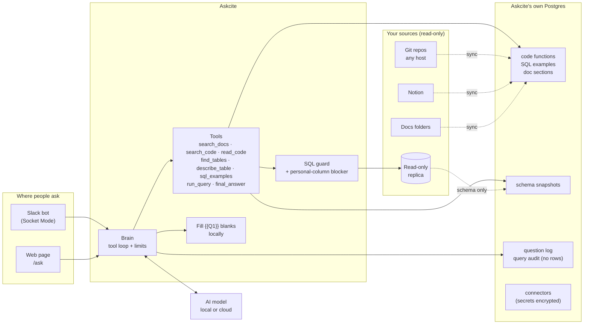
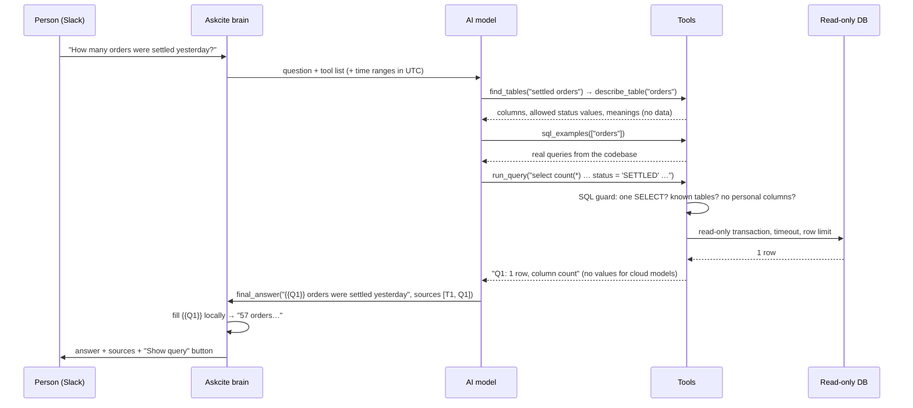

# Architecture

Askcite is one Python process (`askcite run`) plus a PostgreSQL database for its own index. Postgres also
stores logs and connectors.

## One question, step by step

## Components

| Part | Code | What it does |
|---|---|---|
| Connectors | `askcite/connectors/` | Slack, Notion, git, Postgres and docs folder. Each has form fields, a connection test, and a way to become a source. Saved in the `connector` table, with secrets encrypted. |
| Runtime | `askcite/runtime.py` | Merges `sources.yaml` with saved connectors. Applies changes without a restart. Background sync per source, with a `sync_run` history. |
| Git | `askcite/sources/git.py` | Read-only mirror. Reads files at an exact commit. Links for GitLab, GitHub and Bitbucket. |
| Code parser | `askcite/sources/code_parser.py` | tree-sitter splits Kotlin and Java into functions and classes, and rebuilds SQL written inside strings (`"""…""".trimIndent()`, `"…" + "…"`, `$variables`). |
| Docs | `askcite/sources/notion.py`, `docs_folder.py` | Sections by heading, with links to the exact block or anchor. Only changed pages or files are re-read. |
| Schema | `askcite/sources/postgres.py`, `schema_file.py` | Reads names, types, keys and CHECK lists, live or from a messy SQL file. Never rows. |
| Search | `askcite/search.py` | Postgres full-text search with identifier splitting, trigram similarity on names, SQL examples by table, and literal values used in code. |
| Brain | `askcite/brain.py`, `tools.py` | The tool loop with limits, AI policy, source ids, the final answer and logging. |
| Safety | `askcite/safety/` | The SQL guard and the personal/secret column detector. |
| Runner | `askcite/data/runner.py` | Read-only execution and the audit log. |
| Surfaces | `askcite/slack_bot.py`, `askcite/web/`, `askcite/cli.py` | The Slack bot, the Connectors page and `/ask`, and the CLI. |

## Design decisions

**Postgres full-text search instead of a vector database.** Questions mostly name concrete things: a status, a
feature, a function. Full-text search with camelCase and snake_case splitting, plus trigram matching on
function names, handles these well, and it means one database to run, not two. Embeddings are on the roadmap
as an extra signal.

**SQL examples mined from the code.** The best guide to writing a correct query is how the team already
queries a table: the joins, the status values, the soft-delete flags. Askcite rebuilds the SQL written in the
codebase and shows the AI the closest examples, plus the literal values used for each column.

**Fill-in-the-blanks answers.** Keeping data away from cloud models is a structural rule, not a request in
the prompt. The model never receives the values, so it cannot leak them.

**Connectors in the database, settings in YAML.** Credentials belong in an encrypted store with a UI. Policy
belongs in files you can review. Both stay supported: YAML-defined sources show as read-only on the
Connectors page.

**Socket Mode for Slack.** No public URL, no inbound firewall rule. It works from a laptop or a private subnet.

**Tolerant schema parsing.** Many teams keep a hand-written schema file that isn't valid SQL. Askcite replays
CREATE and ALTER statements in order and repairs common slips, rather than requiring a perfect dump.

**LiteLLM for models.** Switching between a local Ollama model and a cloud model is a one-line config change.
